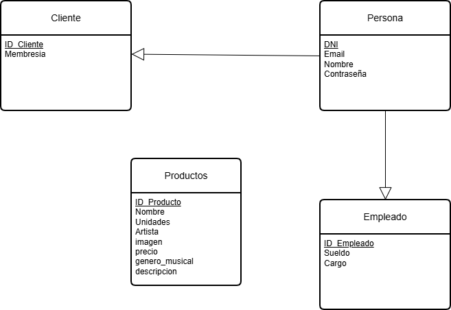
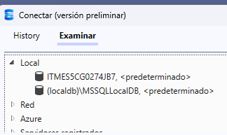
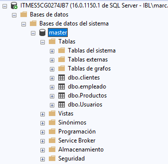

# Configurador-Agil

## Base de Datos

El sistema cuenta con una base de datos relacional compuesta por 4 tablas principales: **Usuario**, **Cliente**, **Empleado** y **Producto**. La tabla Usuario actúa como clase padre tanto para Cliente como para Empleado, mientras que Producto almacena el catálogo de vinilos disponibles.

A continuación se presenta el Modelo Entidad-Relación (MER) de la base de datos:



A partir de este esquema, se ha conectado la base de datos con el backend y se han creado distintas APIs REST según las necesidades de la aplicación.

Las definiciones de las tablas se encuentran en [SQL/tablas.sql](SQL/tablas.sql)

## Obtención de Datos

La información almacenada en la base de datos se ha obtenido mediante web scraping de [una tienda online de vinilos](https://rockntipo.com/19-comprar-vinilos-musica-online). Posteriormente, se ha utilizado un script en Postman para limpiar los datos y convertirlos a formato JSON. Finalmente, se ha desarrollado otro script para automatizar la generación de consultas SQL de inserción de datos.

### Web Scraping con Postman

Utilizando [Postman](https://marcsastreinetum-2466560.postman.co/workspace/marcsastreinetum's-Workspace~a8c010e0-69b5-4020-820e-253e96161e69/request/48331114-5d5e9f0c-c773-45f7-85b4-56c349bcde50?action=share&creator=48331114&ctx=documentationhttps://), se han descargado todos los datos de la [web de vinilos](https://rockntipo.com/19-comprar-vinilos-musica-online) utilizando los parámetros de consulta `?p={pagina}&n={numero de discos por pagina}` para controlar la paginación y cantidad de registros. Para limpiar y estructurar los datos, se ha implementado un script post-response en Postman:

<details>
<summary>Ver código de post Web Scraping (click para expandir)</summary>

```js
const html = pm.response.text();
function decodeHtml(str) {
if (!str) return '';
return str.replace(/&&/g, '&')
.replace(/""/g, '"')
.replace(/''/g, "'")
.replace(/</g, '>');
}
const ulMatch = html.match(/ul[^]*id=["']product_list["'][^>]*>([\s\S]*?)<\/ul>/i);
let ulContent = ulMatch ? ulMatch[1] : '';
const liRegex = /li[^]*>([\s\S]*?)<\/li>/gi;
let match;
const discos = [];
while ((match = liRegex.exec(ulContent)) !== null) {
const li = match[1];
let nombre = '', unidades = '', artista = '', precio = '', descripcion = '', enlace = '', imagen = '';
// Nombre, unidades y artista
const nombreMatch = li.match(/a[^]*class=["']product-name["'][^>]*>([\s\S]*?)<\/a>/i);
if (nombreMatch) {
let raw = decodeHtml(nombreMatch[1]);
let parts = raw.split(/br\s*\|\n/).map(p => p.replace(/<[^>]+>/g, '').trim()).filter(Boolean);
if (parts.length > 0) {
let nombreUnidades = parts[0].match(/^(.+?)(?:\s*\(([^)]*)\))?$/);
if (nombreUnidades) {
nombre = nombreUnidades[1] ? nombreUnidades[1].trim() : '';
unidades = nombreUnidades[2] ? nombreUnidades[2].trim() : '';
} else {
nombre = parts[0];
}
}
if (parts.length > 1) {
artista = parts[1];
}
}
// Enlace
const enlaceMatch = li.match(/a[^]*class=["']product-name["'][^>]*href=["']([^"']+)["']/i);
if (enlaceMatch) {
enlace = decodeHtml(enlaceMatch[1]);
}
// Imagen
const imgMatch = li.match(/img[^]*src=["']([^"']+)["']/i);
if (imgMatch) {
imagen = decodeHtml(imgMatch[1]);
}
// Precio
const precioMatch = li.match(/span[^]*class=["']price product-price["'][^>]*>([\s\S]*?)<\/span>/i);
if (precioMatch) {
precio = decodeHtml(precioMatch[1].replace(/<[^>]+>/g, '').trim());
}
// Descripcion dentro de .pro_second_box > .product-desc
let descMatch = li.match(/div[^]*class=["'][^"']*pro_second_box[^"']*["'][^>]*>([\s\S]*?)<\/div>/i);
if (descMatch) {
let proSecondBox = descMatch[1];
//descripcion = proSecondBox;    let descInnerMatch = proSecondBox.match(/meta[^]+itemprop="description"[^>]+content="([^"]+)"[^>]*>/);
    descripcion = descInnerMatch ? decodeHtml(descInnerMatch[1].replace(/<[^>]+>/g, '').trim()) : '';
    //descripcion = descInnerMatch;
}
discos.push({ nombre, unidades, artista, enlace, imagen, precio, descripcion });
    let descInnerMatch = proSecondBox.match(/meta[^]+itemprop="description"[^>]+content="([^"]+)"[^>]*>/);
    descripcion = descInnerMatch ? decodeHtml(descInnerMatch[1].replace(/<[^>]+>/g, '').trim()) : '';
    //descripcion = descInnerMatch;
}
discos.push({ nombre, unidades, artista, enlace, imagen, precio, descripcion });
}
// Visualización JSON pura
const template = '';
function createPayload() {
return { json: JSON.stringify(discos, null, 2) };
}
pm.visualizer.set(template, createPayload());
// Tests para verificar extracción de precio y descripción
pm.test('Todos los discos tienen campo descripcion extraído', function () {
discos.forEach(disco => {
pm.expect(disco).to.have.property('descripcion');
});
});
pm.test('Todos los discos tienen campo precio extraído', function () {
discos.forEach(disco => {
pm.expect(disco).to.have.property('precio');
});
});
```

</details>

Se realizó web scraping en distintas secciones de la tienda de vinilos para obtener diferentes géneros musicales, generando los siguientes archivos JSON: [hip-hop](BBDD/Archivos_JSON/hiphop.json), [jazz-blues-soul-reggae](BBDD/Archivos_JSON/jazz-blues-soul-reggae.json), [metal](BBDD/Archivos_JSON/metal.json), [rock internacional](BBDD/Archivos_JSON/pop-rock-internacional.json) y [rock nacional](BBDD/Archivos_JSON/pop-rock-nacional.json).

Posteriormente, se desarrolló un [script para unificar todos los géneros](BBDD/scripts/json_unificate.js), obteniendo como resultado [un archivo JSON unificado](BBDD/Archivos_JSON/unificate.json).

### Migración de Datos a MS SQL Server

Para generar las sentencias de inserción SQL, se ha creado [otro script especializado](BBDD/scripts/json_to_mssql_products.js). Este script procesa los datos de los 5 archivos JSON de géneros y permite seleccionar cuántos registros extraer de cada uno, especificando el rango de inicio y fin. Esta funcionalidad permite controlar el número de datos a importar y evitar duplicados al añadir nuevos registros. Las sentencias SQL generadas se almacenan en [un archivo SQL de inserciones](BBDD/SQL/Productos_inserts.sql).

## Instalación de la Base de Datos MS SQL Server e Inserción de Datos

Para utilizar el backend es necesario disponer de una instancia de MS SQL Server donde crear las tablas y almacenar los datos. Esta instancia puede ser local o estar alojada en un servidor externo.

En este proyecto se ha utilizado una base de datos local con [SQL Server 2022 Developer](https://www.microsoft.com/es-es/sql-server/sql-server-downloads). Para la gestión de la base de datos, se ha instalado [SQL Server Management Studio (SSMS)](https://learn.microsoft.com/es-es/ssms/install/install), que se puede instalar desde el instalador de Visual Studio. Aunque es posible gestionar la base de datos directamente desde Visual Studio, se recomienda utilizar SSMS para operaciones de importación de datos.

### Importación de la Estructura de Tablas

Una vez configurado el acceso a la base de datos, es necesario importar la estructura de tablas. Se proporciona [una exportación completa en formato SQL](BBDD/SQL/Bases%20de%20datos%20exportadas/script.sql). Esta exportación debe ejecutarse en la base de datos de destino. En el proyecto se ha utilizado una instancia local (ITMES5CG0274JB7), pero puede utilizarse cualquier servidor disponible.



Seleccione la base de datos correspondiente y ejecute el [script de importación](BBDD/SQL/Bases%20de%20datos%20exportadas/script.sql). Una vez completado este proceso, la estructura de la base de datos estará creada correctamente, si no puedes crear las tablas con [este codigo sql](BBDD/SQL/tablas.sql).



### Importación de Datos de Productos

Se pueden importar los datos de productos utilizando el [script generador de inserciones](BBDD/scripts/json_to_mssql_products.js) y el [archivo SQL de productos generado](BBDD/SQL/Productos_inserts.sql).

### Creación de Usuarios de Prueba

Es posible crear usuarios de prueba mediante inserciones SQL directas o a través del Swagger del backend. A continuación se muestra el script SQL para crear un usuario empleado y un usuario cliente:

<details>
<summary>Inserciones SQL de usuarios (click para expandir)</summary>

```sql
-- Insertar usuarios base
INSERT INTO [dbo].[Usuarios] ([DNI], [Email], [Nombre], [Contrasena])
VALUES 
    ('12345678A', 'juan.perez@empresa.com', 'Juan Pérez', 'password123'),
    ('87654321B', 'maria.garcia@cliente.com', 'María García', 'password456');

-- Insertar empleado (referencia al primer usuario)
INSERT INTO [dbo].[empleado] ([dni], [cargo], [sueldo])
VALUES 
    ('12345678A', 'Gerente de Ventas', 2500.00);

-- Insertar cliente (referencia al segundo usuario)
INSERT INTO [dbo].[clientes] ([membresia], [dni])
VALUES 
    ('Premium', '87654321B');
```

</details>

Una vez completados estos pasos, la base de datos estará configurada con la estructura de tablas, datos de productos y usuarios de prueba listos para su uso.
