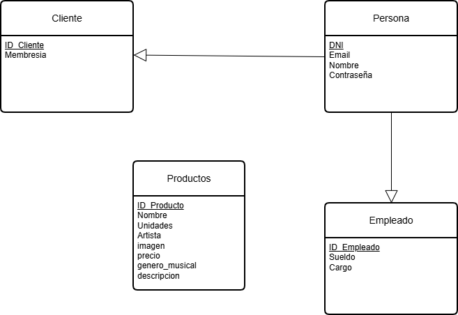

# Configurador-Agil

# 🎵 Aplicación Web Sergio - React + Vite

Esta es una aplicación web desarrollada con **React** y **Vite** que gestiona información sobre vinilos, clientes y empleados. El proyecto está organizado en componentes reutilizables y pantallas específicas, con datos simulados en formato JSON.

## 🚀 Tecnologías utilizadas

- [React](https://reactjs.org/)
- [Vite](https://vitejs.dev/)
- [TypeScript](https://www.typescriptlang.org/)
- [ESLint](https://eslint.org/)
- CSS Modules

## 📁 Estructura del proyecto

- aplicacion-web-seguro-react-vite/
  - node_modules/ → Dependencias del proyecto
  - public/ → Archivos públicos (favicon, imágenes)
    - vite.svg
  - src/ → Código fuente
    - assets/ → Imágenes y recursos estáticos
      - react.svg
    - pages/ → Pantallas y componentes principales
      - data/ → Datos simulados en JSON
        - clientes.json
        - empleados.json
        - vinilos.json
    - components/ → Componentes reutilizables
    - AddVinylScreen.tsx
    - EditVinilo.tsx
    - InfoVinilo.tsx
    - PaginaVinilos.tsx
    - VinylPage.tsx
    - main.tsx → Punto de entrada de la aplicación
  - .gitignore → Archivos ignorados por Git
  - eslint.config.ts → Configuración de ESLint
  - index.html → HTML principal
  - package.json → Dependencias y scripts
  - tsconfig.json → Configuración de TypeScript
  - README.md → Documentación del proyecto
  - vite.config.ts → Configuración de Vit

## 📦 Instalación

1. Clona el repositorio:

   ```bash
   git clone https://github.com/tu-usuario/aplicacion-web-sergio-react-vite.git
   cd aplicacion-web-sergio-react-vite

   ```

2. Instala las dependencias:

   npm install

3. Inicia el servidor de desarrollo:

   npm run dev

Funcionalidades principales- Visualización de vinilos con detalles individuales.

- Edición y creación de nuevos vinilos.
- Visualización de datos simulados de clientes y empleados.
- Navegación entre pantallas con componentes reutilizables.

Scripts disponibles- npm run dev: Inicia el servidor de desarrollo.

- npm run build: Compila la aplicación para producción.
- npm run lint: Ejecuta ESLint para análisis de código.

## Uso de la aplicación

- Landing page:
La landing page, PaginaVinilos, permite consultar los vinilos registrados y seleccionar el usuario, dependiendo del usuario elegido, se pueden añadir vinilos adicionales, en el caso de ser un usuario empleado, en el caso del usuario normal, solo puede consultar información de estos.

- EditVinilo:
La página de edición de vinilos, solo accesible si el usuario elegido es empleado, permite editar los campos del vinilo (titulo, artista, genero, descripcion, imagen, precio y unidades).
Una vez modificados, permite guardarlos y los actualiza.

- InfoVinilo:
Accesible para los usuarios base, permite consultar la información del vinilo seleccionado.

- AddVinylScreen:
También únicamente accesible para usuarios empleados, permite añadir nuevos vinilos a la página, además de poder agregar su imagen y campos mencionados en el punto anterior, una vez que el usuario selecciona la opción de guardar, aplica los cambios y agrega el vinilo nuevo.


# 📄 Documentación API (Backend)

## ⚙️ Funcionamiento de la API
Esta API conecta la **base de datos (SQL Server)** con el **Frontend (React + Vite)**.  
Su función principal es **transferir y gestionar datos** entre ambos entornos.

---

## 👤 Usuarios
Cada usuario cuenta con los siguientes atributos:

- **DNI** → `String`
- **Email** → `String`
- **Nombre** → `String`
- **Contraseña** → `String`

### 🔑 Tipos de usuario
Un usuario puede ser de dos tipos, con atributos adicionales:

#### 🔹 Cliente
- **DNI (FK)**
- **Membresía** → `String`

#### 🔹 Empleado
- **DNI (FK)** → `String`
- **Cargo** → `String`
- **Sueldo** → `String`

---

## 💿 Producto (Vinilos)
Los productos disponibles son **vinilos**, con los siguientes atributos:

- **ID** → `INT`
- **Nombre** → `String`
- **Unidades** → `String`
- **Artista** → `String`
- **Imagen** → `String`
- **Precio** → `String`
- **Género** → `String`
- **Descripción** → `String`

---

## 📂 Estructura de modelos
Para manejar estos datos, la API cuenta con una serie de **modelos** ubicados en:
Domain/Entities

Modelos disponibles:
- `Cliente.cs`
- `Empleado.cs`
- `Producto.cs`
- `Usuario.cs`

---

## 🚀 Uso de la API

### 🔗 Conexión a la Base de Datos
La conexión a **SQL Server** se configura en el archivo `appsettings.json` (línea 10):

```json
"DefaultConnection": "Server=ITMES5CG0465FTK;Database=master;Integrated Security=True;TrustServerCertificate=True;"
```
📌 Nota:
En la parte de Server se debe cambiar ITMES5CG0465FTK por el ID del servidor que se va a utilizar.

🌐 Acceso vía Swagger
Una vez la API esté conectada a la base de datos, se podrá usar a través de Swagger, el cual proporciona la URL para que el Frontend acceda a los datos.

🎛️ Control de acciones por la API
Las acciones son ejecutadas en:

API/Controllers

Cada controller contiene las operaciones que se pueden ejecutar sobre cada modelo.

## ✅ Resumen
• 	La API conecta SQL Server ↔ React + Vite.
• 	Gestiona Usuarios (Clientes y Empleados) y Productos (Vinilos).
• 	Los modelos están en .
• 	La conexión se configura en .
• 	El control de acciones se maneja en .
• 	Swagger facilita la interacción y pruebas de la API.

# Base de Datos (MS SQL Server)

El sistema cuenta con una base de datos relacional compuesta por 4 tablas principales: **Usuario**, **Cliente**, **Empleado** y **Producto**. La tabla Usuario actúa como clase padre tanto para Cliente como para Empleado, mientras que Producto almacena el catálogo de vinilos disponibles.

A continuación se presenta el Modelo Entidad-Relación (MER) de la base de datos:



A partir de este esquema, se ha conectado la base de datos con el backend y se han creado distintas APIs REST según las necesidades de la aplicación.

Las definiciones de las tablas se encuentran en estas han sido las siguentes
<details>
<summary>Definiciones de las tablas (click para expandir)</summary>
```sql
CREATE TABLE [dbo].[Usuarios] (
    [DNI]        VARCHAR (50) NOT NULL,
    [Email]      VARCHAR (50) NOT NULL,
    [Nombre]     VARCHAR (50) NOT NULL,
    [Contrasena] VARCHAR (50) NOT NULL,
    PRIMARY KEY CLUSTERED ([DNI] ASC),
    UNIQUE NONCLUSTERED ([Email] ASC)
);
CREATE TABLE [dbo].[empleado] (
    [id_empleado] INT             IDENTITY (1, 1) NOT NULL,
    [dni]         VARCHAR (50)    NOT NULL,
    [cargo]       VARCHAR (255)   NOT NULL,
    [sueldo]      DECIMAL (10, 2) NOT NULL,
    PRIMARY KEY CLUSTERED ([id_empleado] ASC),
    CONSTRAINT [FK_empleado_Usuarios_DNI] FOREIGN KEY ([dni]) REFERENCES [dbo].[Usuarios] ([DNI])
);
CREATE TABLE [dbo].[clientes] (
    [id_cliente] INT          IDENTITY (1, 1) NOT NULL,
    [membresia]  VARCHAR (50) NOT NULL,
    [dni]        VARCHAR (50) NOT NULL,
    PRIMARY KEY CLUSTERED ([id_cliente] ASC),
    CONSTRAINT [FK_cliente_Usuarios_DNI] FOREIGN KEY ([dni]) REFERENCES [dbo].[Usuarios] ([DNI])
);
CREATE TABLE [dbo].[Productos] (
    [ID]          INT           IDENTITY (1, 1) NOT NULL,
    [Nombre]      VARCHAR (50)  NOT NULL,
    [Unidades]    VARCHAR (50)  NOT NULL,
    [Artista]     VARCHAR (50)  NOT NULL,
    [Imagen]      VARCHAR (150) NOT NULL,
    [Precio]      VARCHAR (50)  NOT NULL,
    [Genero]      VARCHAR (50)  NOT NULL,
    [Descripcion] VARCHAR (MAX) NULL,
    PRIMARY KEY CLUSTERED ([ID] ASC)
);
```
</details>


## Obtención de Datos

La información almacenada en la base de datos se ha obtenido mediante web scraping de [una tienda online de vinilos](https://rockntipo.com/19-comprar-vinilos-musica-online). Posteriormente, se ha utilizado un script en Postman para limpiar los datos y convertirlos a formato JSON. Finalmente, se ha desarrollado otro script para automatizar la generación de consultas SQL de inserción de datos.

### Web Scraping con Postman

Utilizando [Postman](https://marcsastreinetum-2466560.postman.co/workspace/marcsastreinetum's-Workspace~a8c010e0-69b5-4020-820e-253e96161e69/request/48331114-5d5e9f0c-c773-45f7-85b4-56c349bcde50?action=share&creator=48331114&ctx=documentationhttps://), se han descargado todos los datos de la [web de vinilos](https://rockntipo.com/19-comprar-vinilos-musica-online) utilizando los parámetros de consulta `?p={pagina}&n={numero de discos por pagina}` para controlar la paginación y cantidad de registros. Para limpiar y estructurar los datos, se ha implementado un script post-response en Postman:

<details>
<summary>Ver código de post Web Scraping (click para expandir)</summary>

```js
const html = pm.response.text();
function decodeHtml(str) {
if (!str) return '';
return str.replace(/&&/g, '&')
.replace(/""/g, '"')
.replace(/''/g, "'")
.replace(/</g, '>');
}
const ulMatch = html.match(/ul[^]*id=["']product_list["'][^>]*>([\s\S]*?)<\/ul>/i);
let ulContent = ulMatch ? ulMatch[1] : '';
const liRegex = /li[^]*>([\s\S]*?)<\/li>/gi;
let match;
const discos = [];
while ((match = liRegex.exec(ulContent)) !== null) {
const li = match[1];
let nombre = '', unidades = '', artista = '', precio = '', descripcion = '', enlace = '', imagen = '';
// Nombre, unidades y artista
const nombreMatch = li.match(/a[^]*class=["']product-name["'][^>]*>([\s\S]*?)<\/a>/i);
if (nombreMatch) {
let raw = decodeHtml(nombreMatch[1]);
let parts = raw.split(/br\s*\|\n/).map(p => p.replace(/<[^>]+>/g, '').trim()).filter(Boolean);
if (parts.length > 0) {
let nombreUnidades = parts[0].match(/^(.+?)(?:\s*\(([^)]*)\))?$/);
if (nombreUnidades) {
nombre = nombreUnidades[1] ? nombreUnidades[1].trim() : '';
unidades = nombreUnidades[2] ? nombreUnidades[2].trim() : '';
} else {
nombre = parts[0];
}
}
if (parts.length > 1) {
artista = parts[1];
}
}
// Enlace
const enlaceMatch = li.match(/a[^]*class=["']product-name["'][^>]*href=["']([^"']+)["']/i);
if (enlaceMatch) {
enlace = decodeHtml(enlaceMatch[1]);
}
// Imagen
const imgMatch = li.match(/img[^]*src=["']([^"']+)["']/i);
if (imgMatch) {
imagen = decodeHtml(imgMatch[1]);
}
// Precio
const precioMatch = li.match(/span[^]*class=["']price product-price["'][^>]*>([\s\S]*?)<\/span>/i);
if (precioMatch) {
precio = decodeHtml(precioMatch[1].replace(/<[^>]+>/g, '').trim());
}
// Descripcion dentro de .pro_second_box > .product-desc
let descMatch = li.match(/div[^]*class=["'][^"']*pro_second_box[^"']*["'][^>]*>([\s\S]*?)<\/div>/i);
if (descMatch) {
let proSecondBox = descMatch[1];
//descripcion = proSecondBox;    let descInnerMatch = proSecondBox.match(/meta[^]+itemprop="description"[^>]+content="([^"]+)"[^>]*>/);
    descripcion = descInnerMatch ? decodeHtml(descInnerMatch[1].replace(/<[^>]+>/g, '').trim()) : '';
    //descripcion = descInnerMatch;
}
discos.push({ nombre, unidades, artista, enlace, imagen, precio, descripcion });
    let descInnerMatch = proSecondBox.match(/meta[^]+itemprop="description"[^>]+content="([^"]+)"[^>]*>/);
    descripcion = descInnerMatch ? decodeHtml(descInnerMatch[1].replace(/<[^>]+>/g, '').trim()) : '';
    //descripcion = descInnerMatch;
}
discos.push({ nombre, unidades, artista, enlace, imagen, precio, descripcion });
}
// Visualización JSON pura
const template = '';
function createPayload() {
return { json: JSON.stringify(discos, null, 2) };
}
pm.visualizer.set(template, createPayload());
// Tests para verificar extracción de precio y descripción
pm.test('Todos los discos tienen campo descripcion extraído', function () {
discos.forEach(disco => {
pm.expect(disco).to.have.property('descripcion');
});
});
pm.test('Todos los discos tienen campo precio extraído', function () {
discos.forEach(disco => {
pm.expect(disco).to.have.property('precio');
});
});
```

</details>

Se realizó web scraping en distintas secciones de la tienda de vinilos para obtener diferentes géneros musicales, generando los siguientes archivos JSON: [hip-hop](BBDD/Archivos_JSON/hiphop.json), [jazz-blues-soul-reggae](https://github.com/AlbertoPV2005/Configurador-Agil/blob/c70b63230a2acc55a0079c43f3cf8fa61bd653db/BBDD/Archivos_JSON/jazz-blues-soul-reggae.json), [metal](https://github.com/AlbertoPV2005/Configurador-Agil/blob/c70b63230a2acc55a0079c43f3cf8fa61bd653db/BBDD/Archivos_JSON/metal.json), [rock internacional](https://github.com/AlbertoPV2005/Configurador-Agil/blob/c70b63230a2acc55a0079c43f3cf8fa61bd653db/BBDD/Archivos_JSON/pop-rock-internacional.json) y [rock nacional](https://github.com/AlbertoPV2005/Configurador-Agil/blob/c70b63230a2acc55a0079c43f3cf8fa61bd653db/BBDD/Archivos_JSON/pop-rock-nacional.json).

Posteriormente, se desarrolló un [script para unificar todos los géneros](https://github.com/AlbertoPV2005/Configurador-Agil/blob/c70b63230a2acc55a0079c43f3cf8fa61bd653db/BBDD/scripts/json_unificate.js), obteniendo como resultado [un archivo JSON unificado](https://github.com/AlbertoPV2005/Configurador-Agil/blob/c70b63230a2acc55a0079c43f3cf8fa61bd653db/BBDD/Archivos_JSON/unificate.json).

### Migración de Datos a MS SQL Server

Para generar las sentencias de inserción SQL, se ha creado [otro script especializado](https://github.com/AlbertoPV2005/Configurador-Agil/blob/c70b63230a2acc55a0079c43f3cf8fa61bd653db/BBDD/scripts/json_to_mssql_products.js). Este script procesa los datos de los 5 archivos JSON de géneros y permite seleccionar cuántos registros extraer de cada uno, especificando el rango de inicio y fin. Esta funcionalidad permite controlar el número de datos a importar y evitar duplicados al añadir nuevos registros. Las sentencias SQL generadas se almacenan en [un archivo SQL de inserciones](https://github.com/AlbertoPV2005/Configurador-Agil/blob/c70b63230a2acc55a0079c43f3cf8fa61bd653db/BBDD/SQL/Productos_inserts.sql).
<details>
<summary>Fichero para insertar datos (click para expandir)</summary>
```sql
-- Inserts generados para [dbo].[Productos]
SET NOCOUNT ON;
BEGIN TRAN;
INSERT INTO [dbo].[Productos] ([Nombre],[Unidades],[Artista],[Imagen],[Precio],[Genero],[Descripcion]) VALUES ('Catalan Graffiti', '1 LP', 'Sidonie', 'https://rockntipo.com/268962-home_default/comprar-vinilo-de-sidonie-catalan-graffiti.jpg', '24,78€', 'poprock-nacional', 'Sidonie - Album Catalan Graffiti (1 LP). Género: Pop/Rock nacional. SIDONIE publican su 12º álbum de estudio: Catalan Graffiti.El próximo 14 de noviembre, SIDONIE lanzan su nuevo disco Catalan Graffiti, su primer trabajo íntegramente en catalán y el 12º álbum de estudio de su carrera. Producido por Sergio Pérez y grabado en los estudios Maik Maier de Barcelona, el disco incluye 12 nuevas canciones del trío formado por Marc Ros, Axel Pi y Jesús Senra, masterizadas por Greg Obis en Chicago Mastering Service.Una edición imprescindible para coleccionistas y seguidores de la banda, disponible en tiendas físicas y plataformas de venta online a partir del 14 de noviembre.');
INSERT INTO [dbo].[Productos] ([Nombre],[Unidades],[Artista],[Imagen],[Precio],[Genero],[Descripcion]) VALUES ('All Is Love And Pain In The Mouse Parade', '2 LP', 'Of Monsters And Men', 'https://rockntipo.com/268974-home_default/comprar-vinilo-de-of-monsters-and-men-all-is-love-and-pain-in-the-mouse-parade-doble.jpg', '33,63€', 'poprock-internacional', 'Of Monsters And Men - Album All Is Love And Pain In The Mouse Parade (2 LP). Género: Pop/Rock internacional. ''All is love and pain in the mouse parade''&nbsp;es el esperado cuarto álbum de la banda. Es una colección de historias sobre cómo el amor y el dolor se entrelazan: sentimientos que pueden parecer opuestos, pero que coexisten y se necesitan mutuamente. El álbum fue escrito, grabado y producido en el estudio casero del grupo en Islandia, con la ayuda de su amigo de la infancia, el ingeniero Bjarni Þór Jensson.');
INSERT INTO [dbo].[Productos] ([Nombre],[Unidades],[Artista],[Imagen],[Precio],[Genero],[Descripcion]) VALUES ('Morfolog&iacute;a', '1 LP Rojo Splatter', 'S&ocirc;ber', 'https://rockntipo.com/268794-home_default/comprar-vinilo-de-sober-morfologia-rojo-splatter.jpg', '40,43€', 'metal-heavy', 'PREVENTA: Disponible el 24/10/2025 Sober - Album Morfología (1 LP Rojo Splatter). Género: Metal. Segundo disco de Sôber, ''Morfología'', que en cierta manera supuso una revolución dentro del denominado por entonces numetal o metal alternativo en nuestro país. Composiciones que abrían la puerta sin ningún reparo a sensaciones y emociones personales: muerte, locura, complejos de inferioridad, desengaño y hasta suicidio. Todo arropado por grandes riffs de guitarra, una base rítmica muy presente y la voz de Carlos Escobedo, tan inconfundible.');
INSERT INTO [dbo].[Productos] ([Nombre],[Unidades],[Artista],[Imagen],[Precio],[Genero],[Descripcion]) VALUES ('Palabra Rota', '1 LP Black', 'Paramo', 'https://rockntipo.com/268921-home_default/comprar-vinilo-de-paramo-palabra-rota-black.jpg', '21,39€', 'jazz-blues-soul-reggae', 'Paramo - Album Palabra Rota (1 LP). Género: FOLK. Páramo es el proyecto personal del -también escritor- Saúl Ibáñez (Lullavy), con el que da salida a sus canciones más desnudas. Tras la publicación en 2023 de un sencillo a medias con Arico (Kwashiokor/ Fuerteventura) y de un disco en directo (Igualada 11/3/2023), el autor sevillano nos entrega ahora por fin su primer trabajo de estudio, titulado «Palabra rota». Grabado con Ernest Gómez y un puñado de amigos en el Estudio de la Paz (L''Hospitalet del Llobregat), este álbum consolida lo que sus referencias anteriores ya apuntaban: gracias a su riqueza de verbo y a una dicción tan elegante como concisa, la música de Páramo nos permite disfrutar de una narrativa que remite a experiencias y momentos de su intimidad, pero que nos interpela desde lo poético, estirando nuestra imaginación con fuerza. «Palabra rota» abre con «Mademoiselle Char.» Una canción que habla del amor como forma de resistencia, de refugio, de la ternura y del cuidado como primer remedio contra la crueldad y la deshumanización. Le sigue «Veneno», sencilla y hermosa pieza sobre la culpa y su alcance, antes de llegar a «MoMA». Tema donde Páramo reflexiona sobre las decisiones que tomamos en la vida, y también sobre todo aquello que no se escoge. El título hace referencia a la entrada del museo donde Ibáñez escribió la letra y, su primer verso, a los meses que vivió en Suecia. El caso es que, justo después de terminar la canción, va y nieva en Sevilla ¡por primera vez en décadas! Cierra la cara A una suerte de murder ballad llamada «Nana del bosque», donde un asesino le canta al viento?Desde la oscuridad de la noche, abre la cara B con «Madrugada» y tras ella nos topamos con «Cántaro». Composición que explicita el sentimiento de desesperación de forma brillante y, ahora sí, enfilamos ya el desenlace del disco con «Desfile». Pieza clave y, seguramente, la composición más enigmática de todas, cuyas vueltas nos preparan para el momento más espiritual del repertorio, en «Sin título #1». Todo un canto a lo intangible, con el que termina «Palabra rota» (y sus conciertos) y en cuya estrofa final se resuelve además el propio título del álbum. Disfrutad!');
INSERT INTO [dbo].[Productos] ([Nombre],[Unidades],[Artista],[Imagen],[Precio],[Genero],[Descripcion]) VALUES ('Kingmaker', '2 LP', 'Xzibit', 'https://rockntipo.com/268903-home_default/comprar-vinilo-de-xzibit-kingmaker-doble.jpg', '39,50€', 'hiphop', 'Xzibit - Album Kingmaker (2 LP). Género: Hip-Hop. Xzibit continúa su imparable evolución; como el&nbsp;título de su nuevo disco indica ya no quiere ser uno más en el mundo del rap, quiere ser el rey, y estas nuevas canciones son tan incontestables que va a ser muy difícil que en lo que queda de año alguien le dispute el trono. Larga vida a un nuevo hito del hip hop americano.&nbsp;');
COMMIT;
-- Total inserts: 5
```
</details>

## Instalación de la Base de Datos MS SQL Server e Inserción de Datos

Para utilizar el backend es necesario disponer de una instancia de MS SQL Server donde crear las tablas y almacenar los datos. Esta instancia puede ser local o estar alojada en un servidor externo.

En este proyecto se ha utilizado una base de datos local con [SQL Server 2022 Developer](https://www.microsoft.com/es-es/sql-server/sql-server-downloads). Para la gestión de la base de datos, se ha instalado [SQL Server Management Studio (SSMS)](https://learn.microsoft.com/es-es/ssms/install/install), que se puede instalar desde el instalador de Visual Studio. Aunque es posible gestionar la base de datos directamente desde Visual Studio, se recomienda utilizar SSMS para operaciones de importación de datos.

### Importación de la Estructura de Tablas

Una vez configurado el acceso a la base de datos, es necesario importar la estructura de tablas. Se proporciona [una exportación completa en formato SQL](https://github.com/AlbertoPV2005/Configurador-Agil/blob/c70b63230a2acc55a0079c43f3cf8fa61bd653db/BBDD/SQL/Bases%20de%20datos%20exportadas/script.sql). Esta exportación debe ejecutarse en la base de datos de destino. En el proyecto se ha utilizado una instancia local (ITMES5CG0274JB7), pero puede utilizarse cualquier servidor disponible.


Seleccione la base de datos correspondiente y ejecute el [script de importación](https://github.com/AlbertoPV2005/Configurador-Agil/blob/c70b63230a2acc55a0079c43f3cf8fa61bd653db/BBDD/SQL/Bases%20de%20datos%20exportadas/script.sql). Una vez completado este proceso, la estructura de la base de datos estará creada correctamente, si no puedes crear las tablas con [este codigo sql](https://github.com/AlbertoPV2005/Configurador-Agil/blob/c70b63230a2acc55a0079c43f3cf8fa61bd653db/BBDD/SQL/tablas.sql).


### Importación de Datos de Productos

Se pueden importar los datos de productos utilizando el [script generador de inserciones](https://github.com/AlbertoPV2005/Configurador-Agil/blob/c70b63230a2acc55a0079c43f3cf8fa61bd653db/BBDD/scripts/json_to_mssql_products.js) y el [archivo SQL de productos generado](https://github.com/AlbertoPV2005/Configurador-Agil/blob/c70b63230a2acc55a0079c43f3cf8fa61bd653db/BBDD/SQL/Productos_inserts.sql).

### Creación de Usuarios de Prueba

Es posible crear usuarios de prueba mediante inserciones SQL directas o a través del Swagger del backend. A continuación se muestra el script SQL para crear un usuario empleado y un usuario cliente:

<details>
<summary>Inserciones SQL de usuarios (click para expandir)</summary>

```sql
-- Insertar usuarios base
INSERT INTO [dbo].[Usuarios] ([DNI], [Email], [Nombre], [Contrasena])
VALUES 
    ('12345678A', 'juan.perez@empresa.com', 'Juan Pérez', 'password123'),
    ('87654321B', 'maria.garcia@cliente.com', 'María García', 'password456');

-- Insertar empleado (referencia al primer usuario)
INSERT INTO [dbo].[empleado] ([dni], [cargo], [sueldo])
VALUES 
    ('12345678A', 'Gerente de Ventas', 2500.00);

-- Insertar cliente (referencia al segundo usuario)
INSERT INTO [dbo].[clientes] ([membresia], [dni])
VALUES 
    ('Premium', '87654321B');
```

</details>

Una vez completados estos pasos, la base de datos estará configurada con la estructura de tablas, datos de productos y usuarios de prueba listos para su uso.
